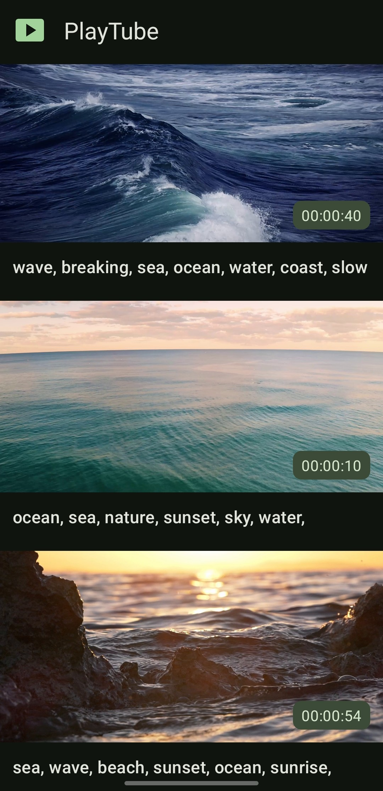
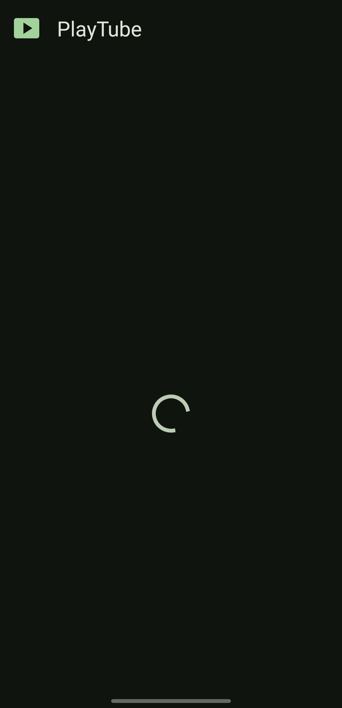
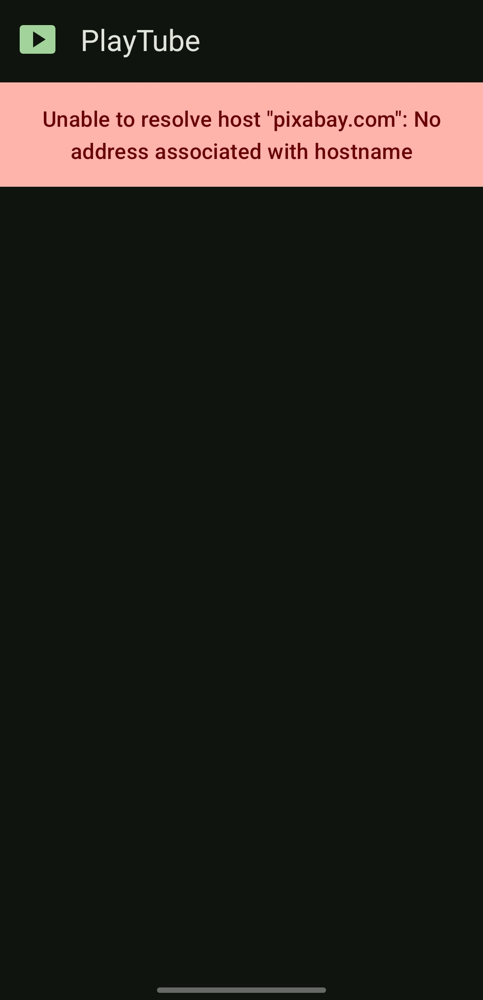
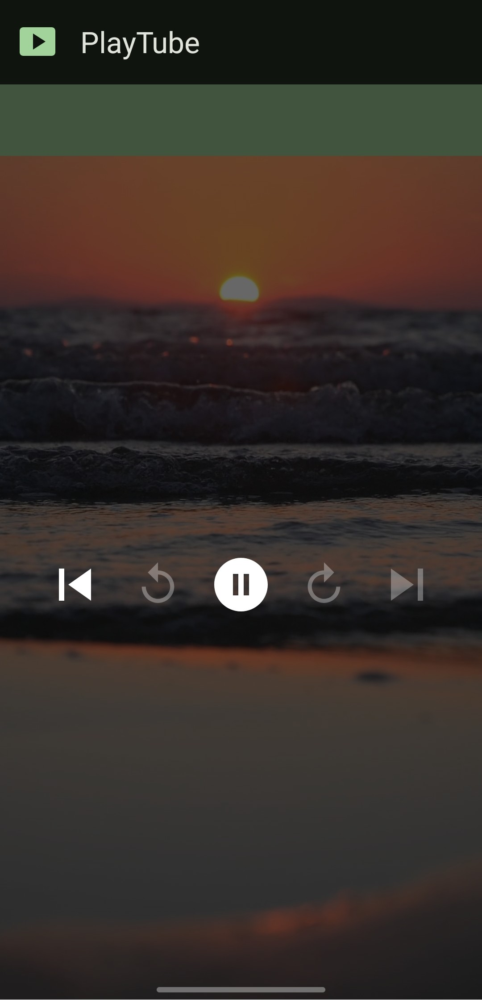
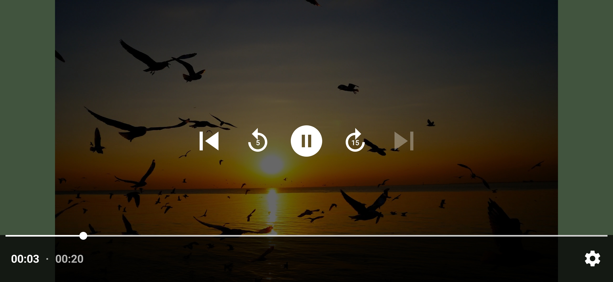

# Приложение для просмотра видео

Этот репозиторий содержит исходный код приложения для просмотра видео с Pixabay.com. Данное приложение является демонстрационным.

## Использованный стек технологий:

- **Kotlin**
- **Coroutines**
- **Glide**
- **Retrofit**
- **Dagger2**
  
## Скриншоты приложения

- ### Главный экран со списком видео
    
    
    

- ### Экран видеоплеера
    
    

## Примечания
- приложение поддерживает светлую и темную темы
- в качестве API использовался pixabay.com
- для работы приложения нужно использовать VPN, т.к API без него не работает
- функция shuffled() имитирует обновление списка при свайпе вниз
